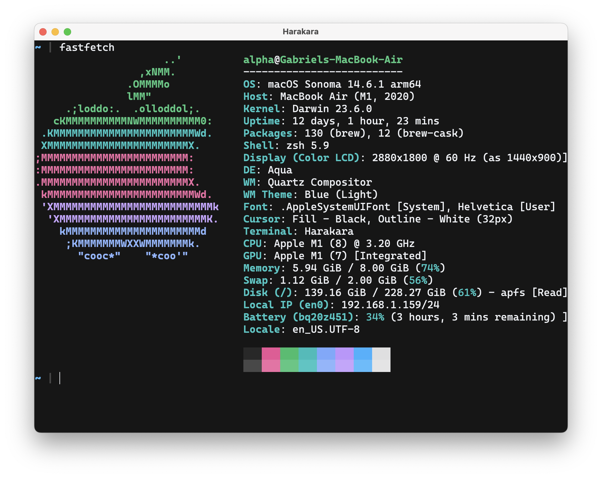

# Harakara Terminal

A simple terminal built in zig using gtk and the VTE library.



## What's this?

So as already stated, this is just a simple terminal written in zig using
the gtk and the vte libraries, which was developed because i wanted to learn
about graphical native applications and specially about terminals in linux.

Also huge thanks to the [anterminal](https://github.com/antma-window-manager/anterminal)
project which I got interested previously as it gave me the idea of implementing
my own terminal using vte but in this case using the zig programming language
which have been catching recently lot of my attention.

## Installation

First install these dependencies:

- vte-2.91 dev library
- gtk+-3.0 dev library
- zig (0.13.0)

> [!NOTE]
> To check if they're installed, use this command `pkg-config --cflags --libs vte-2.91 gtk+-3.0`

Then run these commands:

```sh
git clone https://github.com/AlphaTechnolog/harakara-terminal harakara-terminal
cd harakara-terminal
zig build -Doptimize=ReleaseSafe
```

Then install the binary with this command:

```sh
sudo install -Dvm755 ./zig-out/bin/harakara-terminal /bin/Harakara
```

> Then you'll be able to just run `Harakara` in your terminal.

## Configuration

In the first run harakara will create a config file at ~/.config/harakara/config.toml, so you
can look there and make your modifications, like the terminal colorscheme and the font size.

## Tips and tricks

- Use ctrl and + / ctrl and - to zoom in and zoom out the terminal
- Use ctrl and 0 to reset terminal zoom
- Use ctrl + shift + c and ctrl + shift + v to copy/paste content in the terminal.

## Thanks

- [anterminal](https://github.com/antma-window-manager/anterminal): For the first codebase
- [zig-vte](https://github.com/nfisher1226/zig-vte): Which helped me to see an example on how to link gtk and vte and also gave ideas on how to make the zig bindings (even if they're outdated there D:)
